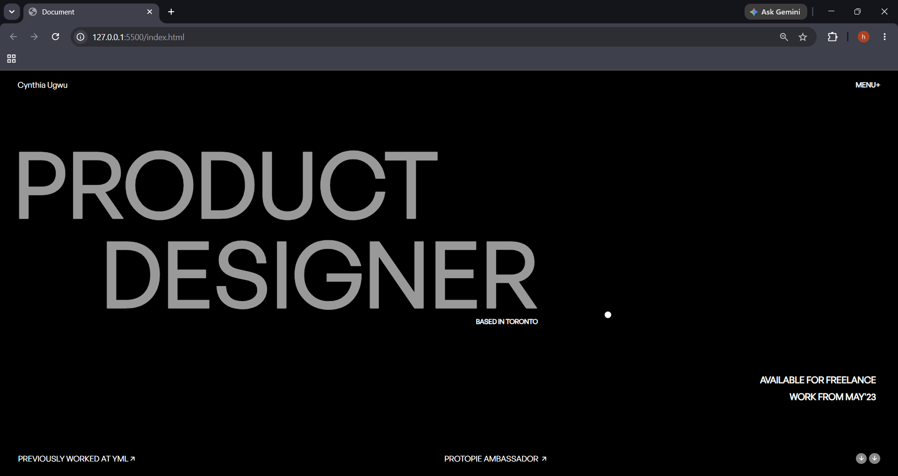

# Cynthia Ugwu Portfolio Clone

A modern and interactive front-end clone of Cynthia Ugwu's award-winning portfolio website. This project recreates the original design while implementing smooth scrolling, advanced animations, custom cursor interactions, and dynamic hover effects using JavaScript and GSAP.
---

## 📖 About The Project

This project is a front-end recreation of Cynthia Ugwu's portfolio website built to practice modern web development concepts such as:

* Advanced CSS layouts
* GSAP animations
* Smooth scrolling effects
* Custom cursor interactions
* Mouse tracking effects
* Responsive design principles

The main goal was to improve animation skills and gain hands-on experience building visually engaging user interfaces.

---

## ✨ Features

### 🎨 User Interface

* Clean and modern design
* Dark-themed portfolio layout
* Responsive structure
* Custom typography using General Sans

### ⚡ Animations

* Hero section reveal animation
* Text slide-up animations
* Smooth scrolling with Locomotive Scroll
* Interactive custom cursor
* Cursor skew/stretch effect based on mouse speed
* Project image hover previews
* Dynamic image rotation on mouse movement

### 🖱 Interactive Effects

* Mouse-following project previews
* Animated hover transitions
* Smooth fade-in/fade-out effects
* Cursor velocity-based transformations

---

## 🛠 Tech Stack

### Frontend

* HTML5
* CSS3
* JavaScript (ES6)

### Libraries

* GSAP (GreenSock Animation Platform)
* Locomotive Scroll
* Remix Icons

---

## 📂 Project Structure

```text
Cynthia-Ugwu-Clone/
│
├── font/
│   ├── GeneralSans-Regular.otf
│   └── GeneralSans-Medium.otf
│
├── images/
│   └── photo.png
│
├── plug.png
├── ixperience.png
├── hudu.png
│
├── index.html
├── style.css
├── script.js
├── loco.css
│
└── README.md
```

---

## 🧠 What I Learned

While building this project, I gained practical experience in:

* Creating smooth page animations with GSAP
* Implementing custom cursor effects
* Working with mouse events and DOM manipulation
* Building image hover interactions
* Managing animation timelines
* Creating responsive layouts
* Improving UI/UX through motion design

---

## ⚙️ Installation

### Clone the repository

```bash
git clone https://github.com/himeshnama007/Cynthia-Ugwu-Clone.git
```

### Navigate to the project folder

```bash
cd Cynthia-Ugwu-Clone
```

### Run the project

Simply open:

```text
index.html
```

in your browser.

---

## 📸 Screenshots

Add screenshots of your project here:





---

## 🔮 Future Improvements

* Full mobile responsiveness
* Dark/Light mode toggle
* Improved accessibility
* Better performance optimization
* Additional page transitions
* More interactive portfolio sections

---

## 🙌 Acknowledgements

* Cynthia Ugwu for the original design inspiration
* GSAP Documentation
* Locomotive Scroll Documentation
* Remix Icons

---

## 📜 Disclaimer

This project is a clone created solely for educational and learning purposes. All design credits belong to the original creator, Cynthia Ugwu.

---

## 👨‍💻 Author

**Himesh Nama**

* GitHub: https://github.com/himeshnama007
* LinkedIn: https://www.linkedin.com/in/himeshnama007/

If you found this project helpful, consider giving it a ⭐ on GitHub.
